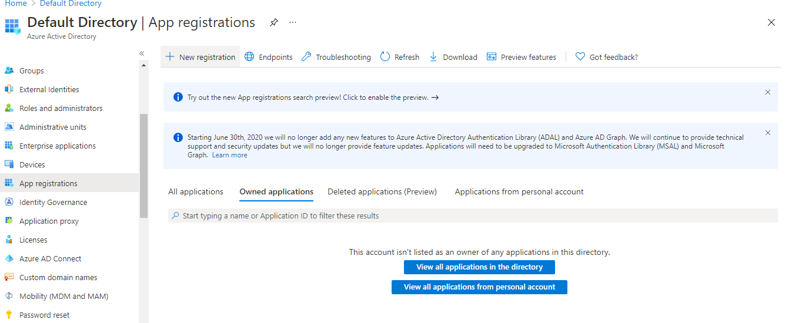
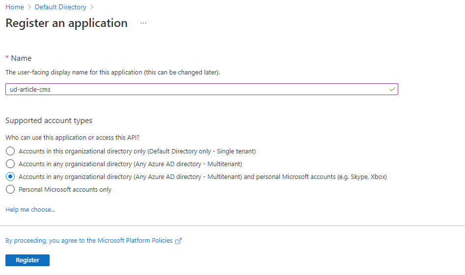
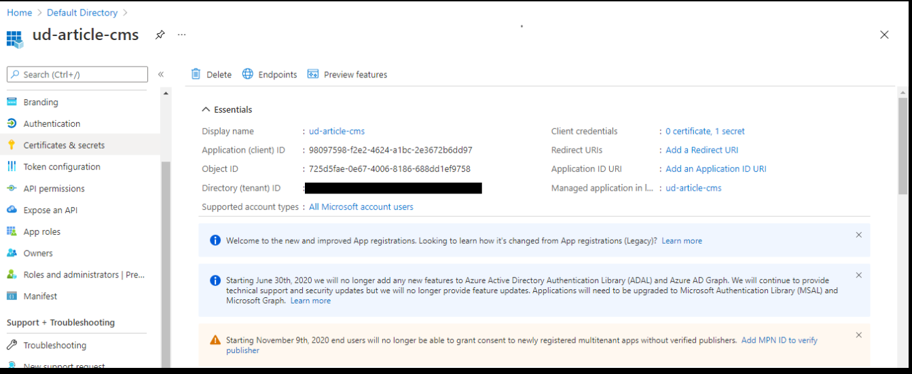
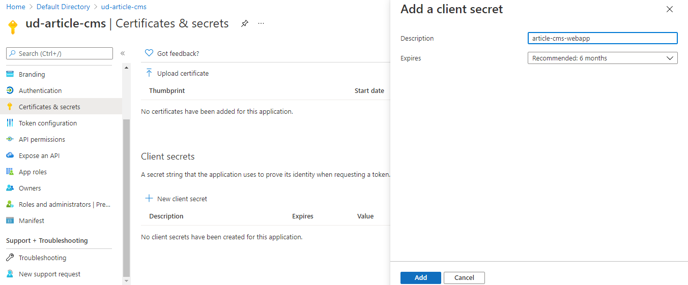
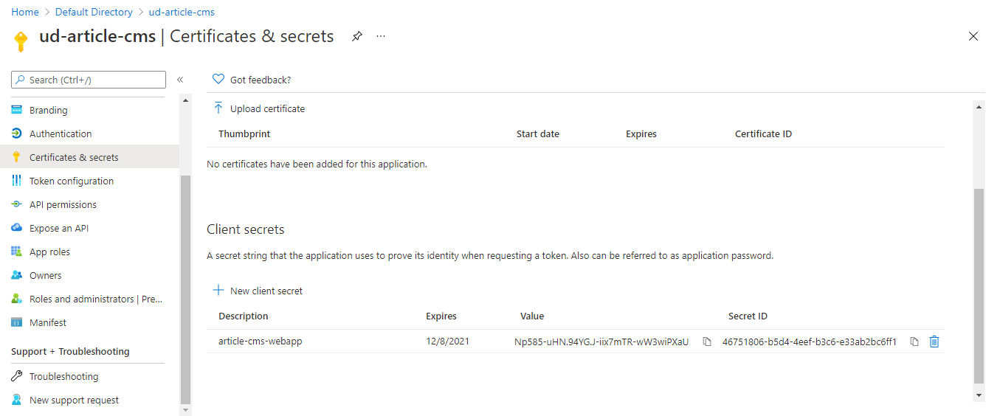
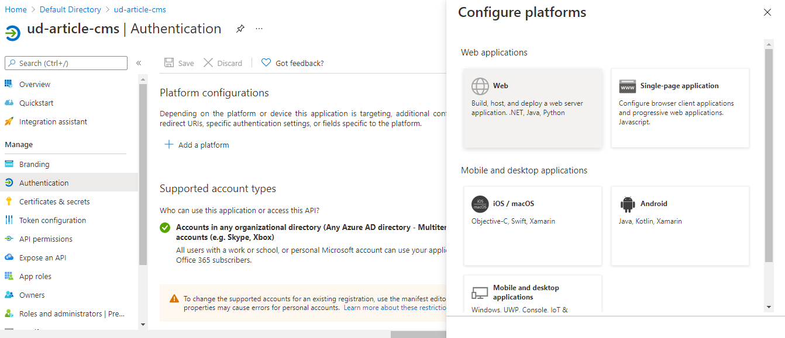
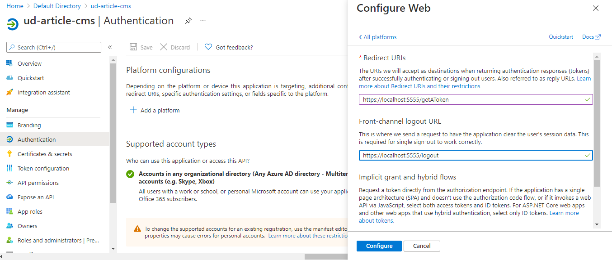
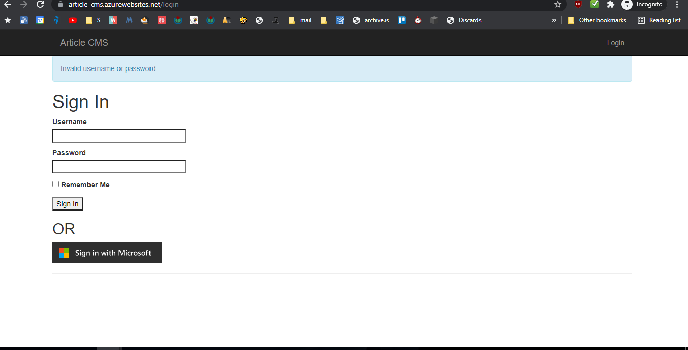
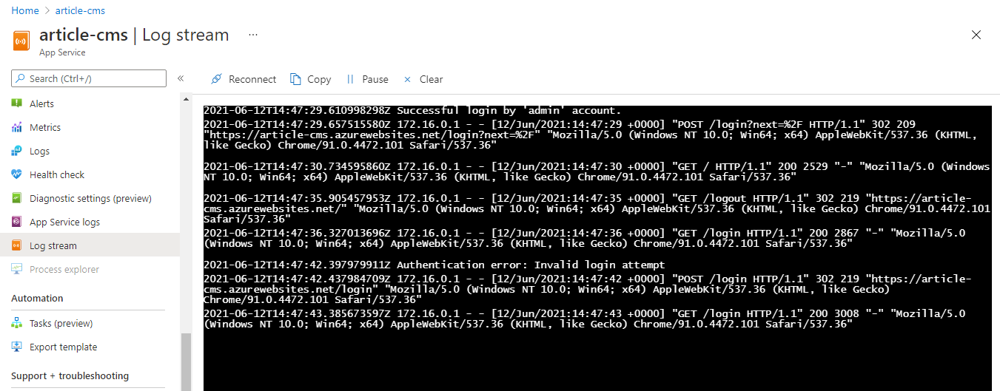

# Introduction to Azure Applications

Notes and code about Azure Applications Nanodegree program: Introduction to Azure Applications

## Sections

- [Introduction to Azure Applications](#introduction-to-azure-applications)
  - [Sections](#sections)
  - [Notes](#notes)
  - [Initial Observations](#initial-observations)
    - [After looking through the starter code](#after-looking-through-the-starter-code)
    - [After looking through the rubric](#after-looking-through-the-rubric)
  - [Project Plan](#project-plan)
  - [Add logging in `FlaskWebProject\__init__.py`](#add-logging-in-flaskwebproject__init__py)
  - [Add authentication logic in `FlaskWebProject\views.py`](#add-authentication-logic-in-flaskwebprojectviewspy)
  - [The web app needs to get it's configuration from environment variables](#the-web-app-needs-to-get-its-configuration-from-environment-variables)
  - [The app needs a resource group](#the-app-needs-a-resource-group)
  - [The app needs a storage account](#the-app-needs-a-storage-account)
  - [The app needs a SQL server instance and it has to be populated via script](#the-app-needs-a-sql-server-instance-and-it-has-to-be-populated-via-script)
  - [The app needs AD for authentication](#the-app-needs-ad-for-authentication)
  - [Setup app locally](#setup-app-locally)
  - [The webapp needs to be setup](#the-webapp-needs-to-be-setup)
  - [Additional Information](#additional-information)
    - [Screenshots](#screenshots)
    - [Links](#links)
  - [Notes template](#notes-template)

## Notes

## Initial Observations

### After looking through the starter code

<!-- TODO add module name and correct exercise name -->
- The code is similar to what was used in the Exercise 4 in the Azure
- I think I only need to add the code, which is similar to what I have done in previous exercises. And provision resources.
- There is a set of sql images

### After looking through the rubric

- We need a screenshot of
  - Resource group
  - Database tables
  - Storage account
  - App in browser
  - Article in app in browser
  - Redirect URIs configured within the App Registration page
  - Screenshot of logs with successful and unsuccessful attempts
- There are things to be done to make the app stand out, and 2 of them sound easy. I should do them.
- There needs to be a writeup as well. Not too long. Maybe a paragraph.

## Project Plan

- Let's try to run the app locally.
- Updated requirements.txt
- App runs well
- Add logging in `FlaskWebProject\__init__.py`
- Add authentication logic in `FlaskWebProject\views.py`
- The web app needs to get it's configuration from environment variables.
- The app needs a resource group.
- The app needs a storage account.
- The app needs a SQL server instance and it has to be populated via script.
- The app needs AD for authentication.
- Setup app locally
- The webapp needs to be setup

## Add logging in `FlaskWebProject\__init__.py`

```python
app.logger.setLevel(logging.INFO)
streamHandler = logging.StreamHandler()
streamHandler.setLevel(logging.INFO)
app.logger.addHandler(streamHandler)
```

- There is a `logging.Logger` object as `app.logger` that can be configured.
- The level can be set with `setLevel` method.
- To handle logging stream, we can add a `logging.StreamHandler` object to the logger.
- The StreamHandler class, located in the core logging package, sends logging output to streams such as sys.stdout, sys.stderr or any file-like object. [Documentation here.](https://docs.python.org/3/library/logging.handlers.html#streamhandler)

## Add authentication logic in `FlaskWebProject\views.py`

```python
"""
Routes and views for the flask application.
"""

import uuid
from datetime import datetime

import msal
from flask import flash, redirect, render_template, request, session, url_for
from flask_login import current_user, login_required, login_user, logout_user
from werkzeug.urls import url_parse

from config import Config
from FlaskWebProject import app, db
from FlaskWebProject.forms import LoginForm, PostForm
from FlaskWebProject.models import Post, User

imageSourceUrl = (
    "https://"
    + app.config["BLOB_ACCOUNT"]
    + ".blob.core.windows.net/"
    + app.config["BLOB_CONTAINER"]
    + "/"
)


@app.route("/")
@app.route("/home")
@login_required
def home():
    user = User.query.filter_by(username=current_user.username).first_or_404()
    posts = Post.query.all()
    return render_template("index.html", title="Home Page", posts=posts)


@app.route("/new_post", methods=["GET", "POST"])
@login_required
def new_post():
    form = PostForm(request.form)
    if form.validate_on_submit():
        post = Post()
        post.save_changes(form, request.files["image_path"], current_user.id, new=True)
        return redirect(url_for("home"))
    return render_template(
        "post.html", title="Create Post", imageSource=imageSourceUrl, form=form
    )


@app.route("/post/<int:id>", methods=["GET", "POST"])
@login_required
def post(id):
    post = Post.query.get(int(id))
    form = PostForm(formdata=request.form, obj=post)
    if form.validate_on_submit():
        post.save_changes(form, request.files["image_path"], current_user.id)
        return redirect(url_for("home"))
    return render_template(
        "post.html", title="Edit Post", imageSource=imageSourceUrl, form=form
    )


@app.route("/login", methods=["GET", "POST"])
def login():
    if current_user.is_authenticated:
        return redirect(url_for("home"))
    form = LoginForm()
    if form.validate_on_submit():
        user = User.query.filter_by(username=form.username.data).first()
        if user is None or not user.check_password(form.password.data):
            flash("Invalid username or password")
            app.logger.info("Authentication error: Invalid login attempt")
            return redirect(url_for("login"))
        login_user(user, remember=form.remember_me.data)
        app.logger.info("Successful login by 'admin' account.")
        next_page = request.args.get("next")
        if not next_page or url_parse(next_page).netloc != "":
            next_page = url_for("home")
        return redirect(next_page)
    session["state"] = str(uuid.uuid4())
    auth_url = _build_auth_url(scopes=Config.SCOPE, state=session["state"])
    return render_template("login.html", title="Sign In", form=form, auth_url=auth_url)


@app.route(
    Config.REDIRECT_PATH
)  # Its absolute URL must match your app's redirect_uri set in AAD
def authorized():
    if request.args.get("state") != session.get("state"):
        app.logger.error("Authentication error")
        return redirect(url_for("home"))  # No-OP. Goes back to Index page
    if "error" in request.args:  # Authentication/Authorization failure
        app.logger.error("Authentication error")
        return render_template("auth_error.html", result=request.args)
    if request.args.get("code"):
        cache = _load_cache()
        client = _build_msal_app(cache=cache)
        token_result = client.acquire_token_by_authorization_code(
            code=request.args.get("code"),
            scopes=Config.SCOPE,
            redirect_uri=url_for("authorized", _external=True, _scheme="https"),
        )
        result = token_result
        if "error" in result:
            app.logger.error("Authentication error: " + str(result["error"]))
            return render_template("auth_error.html", result=result)
        session["user"] = result.get("id_token_claims")
        # Note: In a real app, we'd use the 'name' property from session["user"] below
        # Here, we'll use the admin username for anyone who is authenticated by MS
        user = User.query.filter_by(username="admin").first()
        app.logger.info("Successful login by 'admin' account.")
        login_user(user)
        _save_cache(cache)
    return redirect(url_for("home"))


@app.route("/logout")
def logout():
    logout_user()
    if session.get("user"):  # Used MS Login
        # Wipe out user and its token cache from session
        session.clear()
        # Also logout from your tenant's web session
        return redirect(
            Config.AUTHORITY
            + "/oauth2/v2.0/logout"
            + "?post_logout_redirect_uri="
            + url_for("login", _external=True)
        )

    return redirect(url_for("login"))


def _load_cache():
    cache = msal.SerializableTokenCache()
    if session.get("token_cache"):
        cache.deserialize(session["token_cache"])
    return cache


def _save_cache(cache):
    if cache.has_state_changed:
        # Save the cache in the session
        session["token_cache"] = cache.serialize()


def _build_msal_app(cache=None, authority=None):
    msal_app = msal.ConfidentialClientApplication(
        client_id=Config.CLIENT_ID,
        client_credential=Config.CLIENT_SECRET,
        authority=authority or Config.AUTHORITY,
        token_cache=cache,
    )

    return msal_app


def _build_auth_url(authority=None, scopes=None, state=None):
    client = _build_msal_app(cache=_load_cache(), authority=Config.AUTHORITY)
    auth_url = client.get_authorization_request_url(
        scopes=scopes or [],
        state=state or str(uuid.uuid4()),
        redirect_uri=url_for("authorized", _external=True, _scheme="https"),
    )

    return auth_url
```

- Create method to return a msal.ConfidentialClientApplication object.
- Create a method that will use the `msal.ConfidentialClientApplication` client to return an authorization request url, which will then redirect to the url for "authorized".
- Add authorization logic to `authorized` endpoint.
  - Check if code is present in request.
  - Load cache
  - Create a `ConfidentialClientApplication` object
  - Get a token via `acquire_token_by_authorization_code` method of client.
  - Check for error in result
  - Set session token as user session.
  - Save cache.
- Load cache and deserialize it
- Save serialized cache
- Add logging for successful login and authentication errors.

## The web app needs to get it's configuration from environment variables

- Use `black` on the file `config.py`
- Get configuration from environment variables, and check if they are present

```python
import os

basedir = os.path.abspath(os.path.dirname(__file__))


class Config(object):
    SECRET_KEY = os.environ.get("SECRET_KEY")
    if not SECRET_KEY:
        raise ValueError("No SECRET_KEY set for Flask application")

    BLOB_ACCOUNT = os.environ.get("BLOB_ACCOUNT")
    if not BLOB_ACCOUNT:
        raise ValueError("No BLOB_ACCOUNT set for Flask application")

    BLOB_STORAGE_KEY = os.environ.get("BLOB_STORAGE_KEY")
    if not BLOB_STORAGE_KEY:
        raise ValueError("No BLOB_STORAGE_KEY set for Flask application")

    BLOB_CONTAINER = os.environ.get("BLOB_CONTAINER")
    if not BLOB_CONTAINER:
        raise ValueError("No BLOB_CONTAINER set for Flask application")

    SQL_SERVER = os.environ.get("SQL_SERVER")
    if not SQL_SERVER:
        raise ValueError("No SQL_SERVER set for Flask application")

    SQL_DATABASE = os.environ.get("SQL_DATABASE")
    if not SQL_DATABASE:
        raise ValueError("No SQL_DATABASE set for Flask application")

    SQL_USER_NAME = os.environ.get("SQL_USER_NAME")
    if not SQL_USER_NAME:
        raise ValueError("No SQL_USER_NAME set for Flask application")

    SQL_PASSWORD = os.environ.get("SQL_PASSWORD")
    if not SQL_PASSWORD:
        raise ValueError("No SQL_PASSWORD set for Flask application")

    # Below URI may need some adjustments for driver version, based on your OS, if running locally
    SQLALCHEMY_DATABASE_URI = (
        "mssql+pyodbc://"
        + SQL_USER_NAME
        + "@"
        + SQL_SERVER
        + ":"
        + SQL_PASSWORD
        + "@"
        + SQL_SERVER
        + ":1433/"
        + SQL_DATABASE
        + "?driver=ODBC+Driver+17+for+SQL+Server"
    )
    SQLALCHEMY_TRACK_MODIFICATIONS = False

    ### Info for MS Authentication ###
    ### As adapted from: https://github.com/Azure-Samples/ms-identity-python-webapp ###
    CLIENT_SECRET = os.environ.get("CLIENT_SECRET")
    if not CLIENT_SECRET:
        raise ValueError("No CLIENT_SECRET set for Flask application")
    # In your production app, Microsoft recommends you to use other ways to store your secret,
    # such as KeyVault, or environment variable as described in Flask's documentation here:
    # https://flask.palletsprojects.com/en/1.1.x/config/#configuring-from-environment-variables
    # CLIENT_SECRET = os.getenv("CLIENT_SECRET")
    # if not CLIENT_SECRET:
    #     raise ValueError("Need to define CLIENT_SECRET environment variable")

    AUTHORITY = (
        "https://login.microsoftonline.com/common"
    )  # For multi-tenant app, else put tenant name
    # AUTHORITY = "https://login.microsoftonline.com/Enter_the_Tenant_Name_Here"

    CLIENT_ID = os.environ.get("CLIENT_ID")
    if not CLIENT_ID:
        raise ValueError("No CLIENT_ID set for Flask application")

    REDIRECT_PATH = (
        "/getAToken"
    )  # Used to form an absolute URL; must match to app's redirect_uri set in AAD

    # You can find the proper permission names from this document
    # https://docs.microsoft.com/en-us/graph/permissions-reference
    SCOPE = ["User.Read"]  # Only need to read user profile for this app

    SESSION_TYPE = "filesystem"  # Token cache will be stored in server-side session
```

If using powershell, add the environment variables to the `ienv\Scripts\Activate.ps1` script

```powershell
# Environment Variables
$env:SECRET_KEY = "TODO"
$env:BLOB_ACCOUNT = "TODO"
$env:BLOB_STORAGE_KEY = "TODO"
$env:BLOB_CONTAINER = "TODO"
$env:SQL_SERVER = "TODO"
$env:SQL_DATABASE = "TODO"
$env:SQL_USER_NAME = "TODO"
$env:SQL_PASSWORD = "TODO"
$env:CLIENT_SECRET = "TODO"
$env:CLIENT_ID = "TODO"
```

## The app needs a resource group

- Create a resource group `ud-article-cms` using `az group create --location westus2 --name ud-article-cms`

```powershell
Article-CMS-Udacity-Azure-Nanodegree on  views [!?] via 🐍 v3.9.5 (ienv) on ☁️  (us-east-1) took 9s
❯ az group create --location westus2 --name ud-article-cms
{
  "id": "/subscriptions/id_string/resourceGroups/ud-article-cms",
  "location": "westus2",
  "managedBy": null,
  "name": "ud-article-cms",
  "properties": {
    "provisioningState": "Succeeded"
  },
  "tags": null,
  "type": "Microsoft.Resources/resourceGroups"
}
(ienv)
Article-CMS-Udacity-Azure-Nanodegree on  views [!?] via 🐍 v3.9.5 (ienv) on ☁️  (us-east-1) took 1m36s
❯
```

## The app needs a storage account

- Create a storage account with `az storage account create --name udarticlecmsstorage --resource-group ud-article-cms --location westus2 --access-tier Cool`

```powershell
(ienv)
Article-CMS-Udacity-Azure-Nanodegree on  views [!?] via 🐍 v3.9.5 (ienv) on ☁️  (us-east-1) took 1m36s
❯ az storage account create --name udarticlecmsstorage --resource-group ud-article-cms --location westus2 --access-tier Cool
{
  "accessTier": "Cool",
  "allowBlobPublicAccess": null,
  "azureFilesIdentityBasedAuthentication": null,
  "blobRestoreStatus": null,
  "creationTime": "2021-06-12T13:10:20.884878+00:00",
  "customDomain": null,
  "enableHttpsTrafficOnly": true,
  "encryption": {
    "keySource": "Microsoft.Storage",
    "keyVaultProperties": null,
    "requireInfrastructureEncryption": null,
    "services": {
      "blob": {
        "enabled": true,
        "keyType": "Account",
        "lastEnabledTime": "2021-06-12T13:10:20.962967+00:00"
      },
      "file": {
        "enabled": true,
        "keyType": "Account",
        "lastEnabledTime": "2021-06-12T13:10:20.962967+00:00"
      },
      "queue": null,
      "table": null
    }
  },
  "failoverInProgress": null,
  "geoReplicationStats": null,
  "id": "/subscriptions/id_string/resourceGroups/ud-article-cms/providers/Microsoft.Storage/storageAccounts/udarticlecmsstorage",
  "identity": null,
  "isHnsEnabled": null,
  "kind": "StorageV2",
  "largeFileSharesState": null,
  "lastGeoFailoverTime": null,
  "location": "westus2",
  "minimumTlsVersion": null,
  "name": "udarticlecmsstorage",
  "networkRuleSet": {
    "bypass": "AzureServices",
    "defaultAction": "Allow",
    "ipRules": [],
    "virtualNetworkRules": []
  },
  "primaryEndpoints": {
    "blob": "https://udarticlecmsstorage.blob.core.windows.net/",
    "dfs": "https://udarticlecmsstorage.dfs.core.windows.net/",
    "file": "https://udarticlecmsstorage.file.core.windows.net/",
    "internetEndpoints": null,
    "microsoftEndpoints": null,
    "queue": "https://udarticlecmsstorage.queue.core.windows.net/",
    "table": "https://udarticlecmsstorage.table.core.windows.net/",
    "web": "https://udarticlecmsstorage.z5.web.core.windows.net/"
  },
  "primaryLocation": "westus2",
  "privateEndpointConnections": [],
  "provisioningState": "Succeeded",
  "resourceGroup": "ud-article-cms",
  "routingPreference": null,
  "secondaryEndpoints": {
    "dfs": "https://udarticlecmsstorage-secondary.dfs.core.windows.net/",
    "file": null,
    "internetEndpoints": null,
    "microsoftEndpoints": null,
    "queue": "https://udarticlecmsstorage-secondary.queue.core.windows.net/",
    "table": "https://udarticlecmsstorage-secondary.table.core.windows.net/",
    "web": "https://udarticlecmsstorage-secondary.z5.web.core.windows.net/"
  },
  "secondaryLocation": "westcentralus",
  "sku": {
    "name": "Standard_RAGRS",
    "tier": "Standard"
  },
  "statusOfPrimary": "available",
  "statusOfSecondary": "available",
  "tags": {},
  "type": "Microsoft.Storage/storageAccounts"
}
(ienv)
Article-CMS-Udacity-Azure-Nanodegree on  views [!?] via 🐍 v3.9.5 (ienv) on ☁️  (us-east-1) took 1m
❯
```

- Create a container with `az storage container create --account-name udarticlecmsstorage --name images --public-access container --resource-group ud-article-cms --auth-mode key`

```powershell
(ienv)
Article-CMS-Udacity-Azure-Nanodegree on  views [!?] via 🐍 v3.9.5 (ienv) on ☁️  (us-east-1) took 1m
❯ az storage container create --account-name udarticlecmsstorage --name images --public-access container --resource-group ud-article-cms --auth-mode key
There are no credentials provided in your command and environment, we will query for the account key inside your storage account.
Please provide --connection-string, --account-key or --sas-token as credentials, or use `--auth-mode login` if you have required RBAC roles in your command. For more information about RBAC roles in storage, visit https://docs.microsoft.com/en-us/azure/storage/common/storage-auth-aad-rbac-cli.
Setting the corresponding environment variables can avoid inputting credentials in your command. Please use --help to get more information.
{
  "created": true
}
(ienv)
Article-CMS-Udacity-Azure-Nanodegree on  views [!?] via 🐍 v3.9.5 (ienv) on ☁️  (us-east-1) took 26s
❯
```

## The app needs a SQL server instance and it has to be populated via script

- Create an SQL server using `az sql server create --admin-user admin_article_cms --admin-password kdhjfgdfdAdsftj1. --name sql-ud-article-cms --resource-group ud-article-cms --location westus2 --enable-public-network true --verbose`
- Password policies [here.](https://stackoverflow.com/questions/34157416/azure-sql-login-password-not-complex-enough)

```powershell
(ienv)
Article-CMS-Udacity-Azure-Nanodegree on  views [!?] via 🐍 v3.9.5 (ienv) on ☁️  (us-east-1) took 2s
❯ az sql server create --admin-user admin_article_cms --admin-password kdhjfgdfdAdsftj1. --name sql-ud-article-cms --resource-group ud-article-cms
--location westus2 --enable-public-network true --verbose
Argument '--enable-public-network' is in preview. It may be changed/removed in a future release.
  "administratorLogin": "admin_article_cms",
  "administratorLoginPassword": null,
  "id": "/subscriptions/id_string/resourceGroups/ud-article-cms/providers/Microsoft.Sql/servers/sql-ud-article-cms",
  "identity": null,
  "kind": "v12.0",
  "location": "westus2",
  "minimalTlsVersion": null,
  "name": "sql-ud-article-cms",
  "privateEndpointConnections": [],
  "publicNetworkAccess": "Enabled",
  "resourceGroup": "ud-article-cms",
  "state": "Ready",
  "tags": null,
  "type": "Microsoft.Sql/servers",
  "version": "12.0"
}
Command ran in 55.935 seconds (init: 0.342, invoke: 55.593)
(ienv)
Article-CMS-Udacity-Azure-Nanodegree on  views [!?] via 🐍 v3.9.5 (ienv) on ☁️  (us-east-1) took 1m4s
❯
(ienv)
Article-CMS-Udacity-Azure-Nanodegree on  views [!?] via 🐍 v3.9.5 (ienv) on ☁️  (us-east-1) took 1m4s
❯ az sql server list
[
    "administratorLogin": "admin_article_cms",
    "administratorLoginPassword": null,
    "fullyQualifiedDomainName": "sql-ud-article-cms.database.windows.net",
    "id": "/subscriptions/id_string/resourceGroups/ud-article-cms/providers/Microsoft.Sql/servers/sql-ud-article-cms",
    "identity": null,
    "kind": "v12.0",
    "location": "westus2",
    "minimalTlsVersion": null,
    "name": "sql-ud-article-cms",
    "privateEndpointConnections": [],
    "publicNetworkAccess": "Enabled",
    "resourceGroup": "ud-article-cms",
    "state": "Ready",
    "tags": null,
    "type": "Microsoft.Sql/servers",
    "version": "12.0"
  }
]
(ienv)
Article-CMS-Udacity-Azure-Nanodegree on  views [!?] via 🐍 v3.9.5 (ienv) on ☁️  (us-east-1) took 9s
❯
```

- Create a firewall rule for access within Azure `az sql server firewall-rule create --resource-group ud-article-cms --server sql-ud-article-cms --name azureaccess --start-ip-address 0.0.0.0 --end-ip-address 0.0.0.0 --verbose`

```powershell
(ienv)
Article-CMS-Udacity-Azure-Nanodegree on  views [!?] via 🐍 v3.9.5 (ienv) on ☁️  (us-east-1) took 9s
❯ az sql server firewall-rule create --resource-group ud-article-cms --server sql-ud-article-cms --name azureaccess --start-ip-address 0.0.0.0 --end-ip-address 0.0.0.0 --verbose
{
  "endIpAddress": "0.0.0.0",
  "id": "/subscriptions/id_string/resourceGroups/ud-article-cms/providers/Microsoft.Sql/servers/sql-ud-article-cms/firewallRules/azureaccess",
  "kind": "v12.0",
  "location": "West US 2",
  "name": "azureaccess",
  "resourceGroup": "ud-article-cms",
  "startIpAddress": "0.0.0.0",
  "type": "Microsoft.Sql/servers/firewallRules"
}
Command ran in 3.038 seconds (init: 0.287, invoke: 2.751)
(ienv)
Article-CMS-Udacity-Azure-Nanodegree on  views [!?] via 🐍 v3.9.5 (ienv) on ☁️  (us-east-1) took 11s
❯
```

- Create a firewall rule for access from client IP `az sql server firewall-rule create --resource-group ud-article-cms --server sql-ud-article-cms --name clientip --start-ip-address 103.88.216.152 --end-ip-address 103.88.216.152 --verbose`

```powershell
(ienv)
Article-CMS-Udacity-Azure-Nanodegree on  views [!?] via 🐍 v3.9.5 (ienv) on ☁️  (us-east-1) took 11s
❯ az sql server firewall-rule create --resource-group ud-article-cms --server sql-ud-article-cms --name clientip --start-ip-address 103.88.216.152
--end-ip-address 103.88.216.152 --verbose
{
  "endIpAddress": "103.88.216.152",
  "id": "/subscriptions/id_string/resourceGroups/ud-article-cms/providers/Microsoft.Sql/servers/sql-ud-article-cms/firewallRules/clientip",
  "kind": "v12.0",
  "location": "West US 2",
  "name": "clientip",
  "resourceGroup": "ud-article-cms",
  "startIpAddress": "103.88.216.152",
  "type": "Microsoft.Sql/servers/firewallRules"
}
Command ran in 3.099 seconds (init: 0.328, invoke: 2.771)
(ienv)
Article-CMS-Udacity-Azure-Nanodegree on  views [!?] via 🐍 v3.9.5 (ienv) on ☁️  (us-east-1) took 6s
❯
```

- Create a new database `az sql db create --name article-cms-db --resource-group ud-article-cms --server sql-ud-article-cms --tier Basic --verbose`

```powershell
(ienv)
Article-CMS-Udacity-Azure-Nanodegree on  views [!?] via 🐍 v3.9.5 (ienv) on ☁️  (us-east-1) took 6s
❯ az sql db create --name article-cms-db --resource-group ud-article-cms --server sql-ud-article-cms --tier Basic --verbose
{
  "autoPauseDelay": null,
  "backupStorageRedundancy": "Geo",
  "catalogCollation": "SQL_Latin1_General_CP1_CI_AS",
  "collation": "SQL_Latin1_General_CP1_CI_AS",
  "createMode": null,
  "creationDate": "2021-06-12T13:31:27.613000+00:00",
  "currentServiceObjectiveName": "Basic",
  "currentSku": {
    "capacity": 5,
    "family": null,
    "name": "Basic",
    "size": null,
    "tier": "Basic"
  },
  "databaseId": "f00795e2-304f-4142-9f1b-f54ff60e5396",
  "defaultSecondaryLocation": "westcentralus",
  "earliestRestoreDate": null,
  "edition": "Basic",
  "elasticPoolId": null,
  "elasticPoolName": null,
  "failoverGroupId": null,
  "id": "/subscriptions/id_string/resourceGroups/ud-article-cms/providers/Microsoft.Sql/servers/sql-ud-article-cms/databases/article-cms-db",
  "kind": "v12.0,user",
  "licenseType": null,
  "location": "westus2",
  "longTermRetentionBackupResourceId": null,
  "managedBy": null,
  "maxLogSizeBytes": null,
  "maxSizeBytes": 2147483648,
  "minCapacity": null,
  "name": "article-cms-db",
  "pausedDate": null,
  "readReplicaCount": 0,
  "readScale": "Disabled",
  "recoverableDatabaseId": null,
  "recoveryServicesRecoveryPointId": null,
  "requestedServiceObjectiveName": "Basic",
  "resourceGroup": "ud-article-cms",
  "restorePointInTime": null,
  "resumedDate": null,
  "sampleName": null,
  "sku": {
    "capacity": 5,
    "family": null,
    "name": "Basic",
    "size": null,
    "tier": "Basic"
  },
  "sourceDatabaseDeletionDate": null,
  "sourceDatabaseId": null,
  "status": "Online",
  "tags": null,
  "type": "Microsoft.Sql/servers/databases",
  "zoneRedundant": false
}
Command ran in 76.070 seconds (init: 0.425, invoke: 75.644)
(ienv)
Article-CMS-Udacity-Azure-Nanodegree on  views [!?] via 🐍 v3.9.5 (ienv) on ☁️  (us-east-1) took 1m17s
❯
```

## The app needs AD for authentication

- [Azure docs here](https://docs.microsoft.com/en-us/azure/active-directory/develop/quickstart-register-app).
- Go to Azure AD in the azure portal.
- Click on `App Registrations`
- Click on `New registration`
  
- Choose `Accounts in any organizational directory (Any Azure AD directory - Multitenant) and personal Microsoft accounts (e.g. Skype, Xbox)`
- Create the name as `ud-article-cms`
- Click on Register
  
- Note down Application (client) ID `98097598-f2e2-4624-a1bc-2e3672b6dd97`.
  
- Go to `Certificates & secrets`
- Click on `New client secret`
- Add a description of the secret and set expiration time
  
- Copy secret ID `46751806-b5d4-4eef-b3c6-e33ab2bc6ff1` and value `Np585-uHN.94YG.J-iix7mTR-wW3wiPXaU`
  
- Click on `Authentication` and then `Add a platform` and then choose `Web`
  
- Add the redirect URI for where to send the tokens as `https://localhost:5555/getAToken`
- Add the URI which will logout the user session as `https://localhost:5555/logout`
  

## Setup app locally

- Add the values for the environment variables in the powershell `ienv\Scripts\Activate.ps1` script and the `.env` file

```.env
SECRET_KEY=9cSnjBfjzqbzzlM4zLcA
BLOB_ACCOUNT=udarticlecmsstorage
BLOB_STORAGE_KEY=WBU68EZjZeYNl8wzSHrKzFT/sNUJ4WxhvFY9Ezz4Kyrnh5Pw+4p4HbvoNyMBASb1GToG6xZ6aJhHRlFsUTEx+g==
BLOB_CONTAINER=images
SQL_SERVER=sql-ud-article-cms.database.windows.net
SQL_DATABASE=article-cms-db
SQL_USER_NAME=admin_article_cms
SQL_PASSWORD=kdhjfgdfdAdsftj1.
CLIENT_SECRET=Np585-uHN.94YG.J-iix7mTR-wW3wiPXaU
CLIENT_ID=98097598-f2e2-4624-a1bc-2e3672b6dd97
```

```powershell
# Environment Variables
$env:SECRET_KEY = "9cSnjBfjzqbzzlM4zLcA"
$env:BLOB_ACCOUNT = "udarticlecmsstorage"
$env:BLOB_STORAGE_KEY = "WBU68EZjZeYNl8wzSHrKzFT/sNUJ4WxhvFY9Ezz4Kyrnh5Pw+4p4HbvoNyMBASb1GToG6xZ6aJhHRlFsUTEx+g=="
$env:BLOB_CONTAINER = "images"
$env:SQL_SERVER = "sql-ud-article-cms.database.windows.net"
$env:SQL_DATABASE = "article-cms-db"
$env:SQL_USER_NAME = "admin_article_cms"
$env:SQL_PASSWORD = "kdhjfgdfdAdsftj1."
$env:CLIENT_SECRET = "Np585-uHN.94YG.J-iix7mTR-wW3wiPXaU"
$env:CLIENT_ID = "98097598-f2e2-4624-a1bc-2e3672b6dd97"
```

- In the `Query Editor` execute this sql script

```sql
CREATE TABLE USERS (
    id INT NOT NULL IDENTITY(1, 1),
    username VARCHAR(64) NOT NULL,
    password_hash VARCHAR(128) NOT NULL,
    PRIMARY KEY (id)
);

INSERT INTO dbo.users (username, password_hash)
VALUES ('admin', 'pbkdf2:sha256:150000$QlIrz6Hg$5f4cd25d78a6c79906a53f74ef5d3bb2609af2b39d9e5dd6f3beabd8c854dd60')
```

- Now execute this sql script

```sql
CREATE TABLE POSTS(
    id INT NOT NULL IDENTITY(1, 1),
    title VARCHAR(150) NOT NULL,
    author VARCHAR(75) NOT NULL,
    body VARCHAR(800) NOT NULL,
    image_path VARCHAR(100) NULL,
    timestamp DATETIME NOT NULL DEFAULT(GETDATE()),
    user_id INT NOT NULL,
    PRIMARY KEY (id),
    FOREIGN KEY (user_id) REFERENCES users(id)
);

INSERT INTO dbo.posts (title, author, body, user_id)
VALUES (
    'Lorem ipsum dolor sit amet',
    'John Smith',
    'Proin sit amet mi ornare, ultrices augue quis, facilisis tellus. Quisque neque dui, tincidunt sed volutpat quis, maximus sed est. Sed justo orci, rhoncus ac nulla eu, rhoncus luctus justo. Etiam maximus, felis eu varius fermentum, libero orci egestas purus, id condimentum mauris orci nec nibh. Vivamus risus ipsum, semper vel nibh in, suscipit commodo massa. Suspendisse non velit vitae neque condimentum viverra vel eget enim. Vestibulum ante ipsum primis in faucibus orci luctus et ultrices posuere cubilia Curae; Vivamus fermentum sagittis ligula et fringilla. Aenean nec lacinia lacus.',
    1
);
```

- Run the web app

## The webapp needs to be setup

- Provision the app service with `az webapp up --resource-group ud-article-cms --name article-cms --sku F1 --verbose`

```powershell
(ienv)
Article-CMS-Udacity-Azure-Nanodegree on  views [+?] via 🐍 v3.9.5 (ienv) on ☁️  (us-east-1) took 8s
❯ az webapp up --resource-group ud-article-cms --name article-cms --sku F1 --verbose
The webapp 'article-cms' doesn't exist
Found sku argument, skipping use default sku
Creating AppServicePlan 'dbhatta1232_asp_Linux_centralus_0' ...
Creating webapp 'article-cms' ...
will set appsetting for enabling build
Configuring default logging for the app, if not already enabled
Creating zip with contents of dir J:\Education\Code\Cloud\Azure\Article-CMS-Udacity-Azure-Nanodegree ...
Skipping file: J:\Education\Code\Cloud\Azure\Article-CMS-Udacity-Azure-Nanodegree/.env
Getting scm site credentials for zip deployment
Starting zip deployment. This operation can take a while to complete ...
Deployment endpoint responded with status code 202
Preparing deployment for commit id 'cabb3af73e'.
Running oryx build...
Running oryx build...
Running oryx build...
Running oryx build...
Running oryx build...
Running oryx build...
Running oryx build...
Running oryx build...
Running oryx build...
Running oryx build...
Running oryx build...
Running oryx build...
Running oryx build...
Running oryx build...
Running oryx build...
Running oryx build...
Running oryx build...
Running oryx build...
Running oryx build...
Running oryx build...
Running oryx build...
Running oryx build...
Running oryx build...
Running oryx build...
Running oryx build...
Running oryx build...
Running oryx build...
Running oryx build...
Running oryx build...
Running oryx build...
Running oryx build...
Running oryx build...
Running oryx build...
Running oryx build...
Running oryx build...
Running oryx build...
Running oryx build...
Running oryx build...
Running oryx build...
Running oryx build...
Running oryx build...
Running oryx build...
Running oryx build...
Running oryx build...
Running oryx build...
Running oryx build...
Running oryx build...
Running oryx build...
Running oryx build...
Running oryx build...
Running oryx build...
Running oryx build...
Running oryx build...
Running oryx build...
Running oryx build...
Running oryx build...
Running oryx build...
Running oryx build...
Running oryx build...
You can launch the app at http://article-cms.azurewebsites.net
{
  "URL": "http://article-cms.azurewebsites.net",
  "appserviceplan": "dbhatta1232_asp_Linux_centralus_0",
  "location": "centralus",
  "os": "Linux",
  "resourcegroup": "ud-article-cms",
  "runtime_version": "python|3.7",
  "runtime_version_detected": "-",
  "sku": "FREE",
  "src_path": "J:\\Education\\Code\\Cloud\\Azure\\Article-CMS-Udacity-Azure-Nanodegree"
Command ran in 414.279 seconds (init: 0.326, invoke: 413.953)
(ienv)
Article-CMS-Udacity-Azure-Nanodegree on  views [?] via 🐍 v3.9.5 (ienv) on ☁️  (us-east-1) took 7m4s
❯
```

- Add environment variables using `az webapp config appsettings set --resource-group ud-article-cms --name article-cms --settings {settings here in key=value format}`

```powershell
(ienv)
Article-CMS-Udacity-Azure-Nanodegree on  views [!?] via 🐍 v3.9.5 (ienv) on ☁️  (us-east-1) took 20s
❯ az webapp config appsettings set --resource-group ud-article-cms --name article-cms --settings  SECRET_KEY=9cSnjBfjzqbzzlM4zLcA BLOB_ACCOUNT=udarticlecmsstorage BLOB_STORAGE_KEY=WBU68EZjZeYNl8wzSHrKzFT/sNUJ4WxhvFY9Ezz4Kyrnh5Pw+4p4HbvoNyMBASb1GToG6xZ6aJhHRlFsUTEx+g== BLOB_CONTAINER=images SQL_SERVER=sql-ud-article-cms.database.windows.net SQL_DATABASE=article-cms-db SQL_USER_NAME=admin_article_cms SQL_PASSWORD=kdhjfgdfdAdsftj1. CLIENT_SECRET=Np585-uHN.94YG.J-iix7mTR-wW3wiPXaU CLIENT_ID=98097598-f2e2-4624-a1bc-2e3672b6dd97
[
  {
    "name": "SCM_DO_BUILD_DURING_DEPLOYMENT",
    "slotSetting": false,
    "value": "True"
  },
  {
    "name": "WEBSITE_HTTPLOGGING_RETENTION_DAYS",
    "slotSetting": false,
    "value": "3"
  },
  {
    "name": "SECRET_KEY",
    "slotSetting": false,
    "value": "9cSnjBfjzqbzzlM4zLcA"
  },
  {
    "name": "BLOB_ACCOUNT",
    "slotSetting": false,
    "value": "udarticlecmsstorage"
  },
  {
    "name": "BLOB_STORAGE_KEY",
    "slotSetting": false,
    "value": "WBU68EZjZeYNl8wzSHrKzFT/sNUJ4WxhvFY9Ezz4Kyrnh5Pw+4p4HbvoNyMBASb1GToG6xZ6aJhHRlFsUTEx+g=="
  },
  {
    "name": "BLOB_CONTAINER",
    "slotSetting": false,
    "value": "images"
  },
  {
    "name": "SQL_SERVER",
    "slotSetting": false,
    "value": "sql-ud-article-cms.database.windows.net"
  },
  {
    "name": "SQL_DATABASE",
    "slotSetting": false,
    "value": "article-cms-db"
  },
  {
    "name": "SQL_USER_NAME",
    "value": "admin_article_cms"
  },
  {
    "name": "SQL_PASSWORD",
    "slotSetting": false,
    "value": "kdhjfgdfdAdsftj1."
  },
  {
    "name": "CLIENT_SECRET",
    "slotSetting": false,
    "value": "Np585-uHN.94YG.J-iix7mTR-wW3wiPXaU"
  },
  {
    "name": "CLIENT_ID",
    "value": "98097598-f2e2-4624-a1bc-2e3672b6dd97"
  }
(ienv)
Article-CMS-Udacity-Azure-Nanodegree on  views [!?] via 🐍 v3.9.5 (ienv) on ☁️  (us-east-1) took 3s
❯
```

- To update the app from with local changes, use `az webapp up`

```powershell
(ienv)
Article-CMS-Udacity-Azure-Nanodegree on  views [!?] via 🐍 v3.9.5 (ienv) on ☁️  (us-east-1)
❯ az webapp up
Webapp 'article-cms' already exists. The command will deploy contents to the existing app.
Creating AppServicePlan 'dbhatta1232_asp_Linux_centralus_0' ...
Creating zip with contents of dir J:\Education\Code\Cloud\Azure\Article-CMS-Udacity-Azure-Nanodegree ...
Getting scm site credentials for zip deployment
Starting zip deployment. This operation can take a while to complete ...
Deployment endpoint responded with status code 202
You can launch the app at http://article-cms.azurewebsites.net
{
  "URL": "http://article-cms.azurewebsites.net",
  "appserviceplan": "dbhatta1232_asp_Linux_centralus_0",
  "location": "centralus",
  "name": "article-cms",
  "os": "Linux",
  "resourcegroup": "ud-article-cms",
  "runtime_version": "python|3.7",
  "runtime_version_detected": "-",
  "sku": "FREE",
  "src_path": "J:\\Education\\Code\\Cloud\\Azure\\Article-CMS-Udacity-Azure-Nanodegree"
}
```

- Webapp should be up.
  
- To view logs, go to App service in azure portal and click on Log Stream. Login, logout, and then make an unsuccessful login attempt.
  

## Additional Information

### Screenshots

### Links

## Notes template

```language

```
